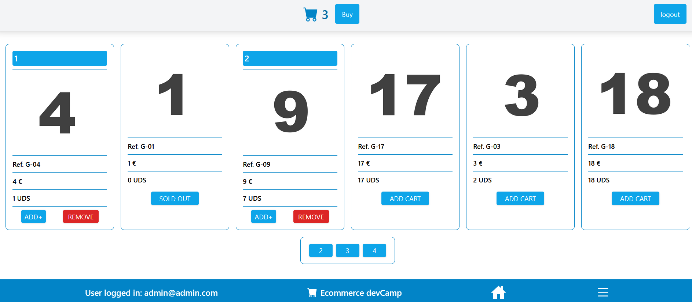

# ecommerce-devcamp

Final full-stack project done using React, Express, Github, CSS, SCSS, mongoDB, JavaScript, HTML, Firebase, Axios ... and hosted on Vercel and Firebase.

<div align="center"></div>

## Features

- View a list of products
- Create a new product
- Update an existing product
- Delete a product

## Installation

1. Clone the repository:

```bash
git clone <repository-url>
```

2. Install the dependencies for the server and client:

```bash
cd server
npm install
cd client
npm install
```

3. Create a .env file in the server directory and set the following environment variables:

```bash
MONGODB_URI=<your-mongodb-connection-string>
PORT=<server-port>
```

4. Start the server and the client:

```bash
cd server
npm server
cd client
npm start
```

5. Open your browser and navigate to http://localhost:3000 to access the app.

API Endpoints

- GET /api/products - Get a list of all products
- POST /api/products - Create a new product
- GET /api/products/:id - Get a product by ID
- PUT /api/products/:id - Update a product by ID
- DELETE /api/products/:id - Delete a product by ID

# Author

Luis Miguel Morais Muñoz

## License

This Project is Distribuited under The MIT License

## Hosting

> client URL: https://app-firebase-56326.web.app/

To access the api https://app-api-server.vercel.app/api/products

## Contact

> Mail (morais.luism@gmail.com)

> GitHub (https://github.com/moraisLuism)
